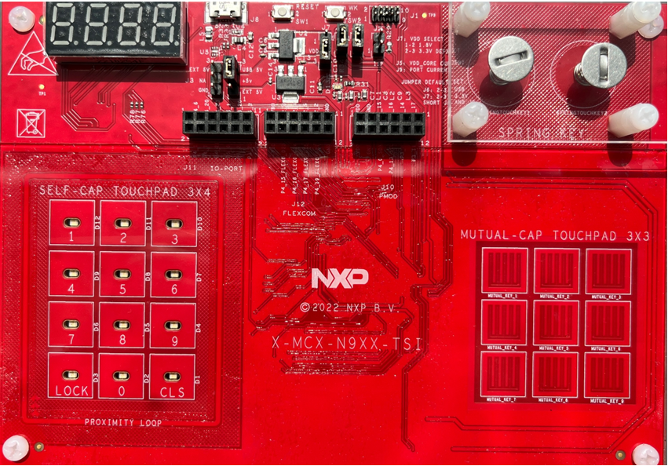
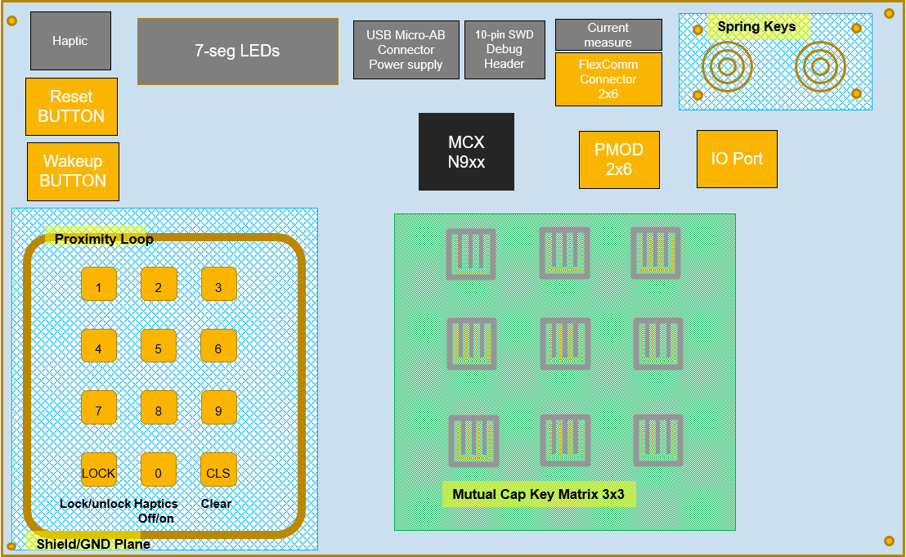
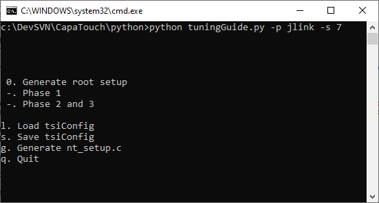
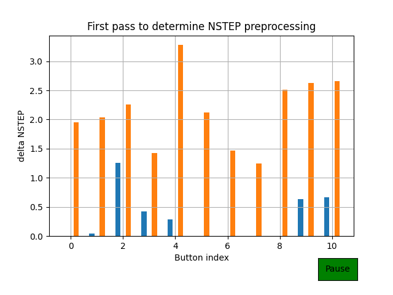
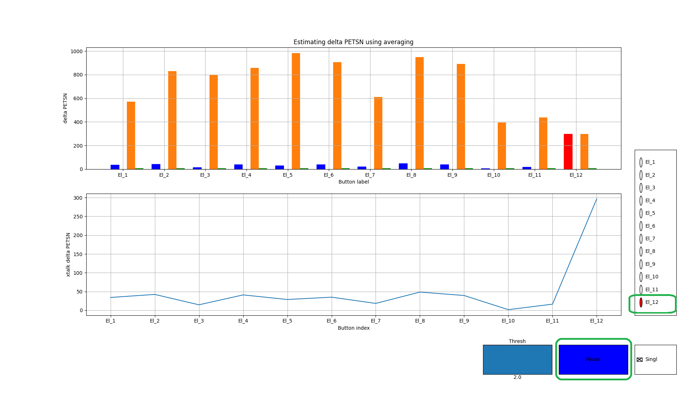
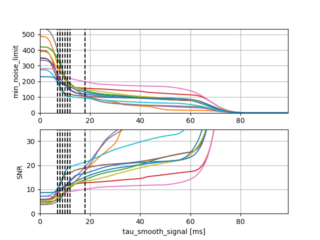
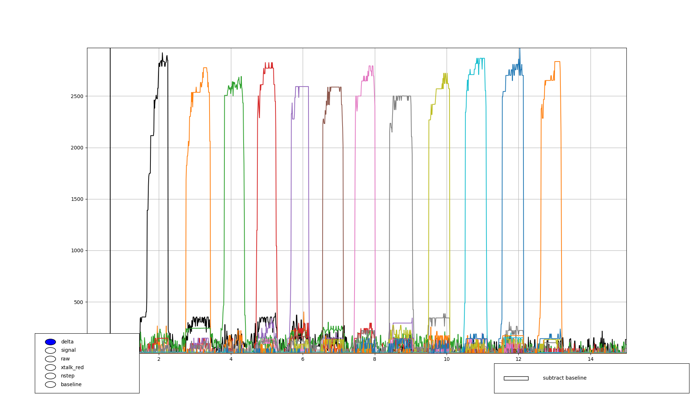
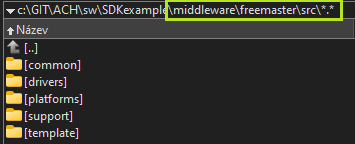
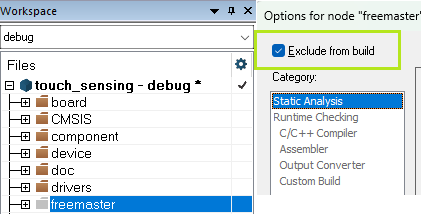

# NXP Application Code Hub

## Touch Keypad Tuning on MCXN
* The demo shows how to use NXP Touch sensing library with the Python tool for Capacitive Touch keypad sensitivity tuning
* NXP partners can obtain the TSI EVB board through their NXP representative
* For the precise keypad sensitivity tuning, the usage of the "artificial finger" probe is recommended.

#### Boards: Custom Board
#### Categories: HMI, Touch Sensing
#### Peripherals: TSI
#### Toolchains: IAR, MCUXpresso IDE

## Table of Contents
1. [Software](#step1)
2. [Hardware](#step2)
3. [Setup](#step3)
4. [Touch Tuning](#step4)
5. [Generated settings](#step5) 
6. [Keydetector MBW](#step6) 
7. [Enabling the FreeMASTER support](#step7) 
8. [Support](#step8)
9. [Release Notes](#step9)

## 1. Software
* This software demonstrates the usage of NXP Touch library running on the MCXN device supporting the TSI peripheral. The example also shows the Touch sensing keypad tuning using the Python script based tool for sensitivity calibration.
* At least NXP Touch library SW ver. 2.11 with a modified key-detector "MBW" is required supporting the calibration values calculated by the Python tuning tool.
* Check file "nt.h" NXP TOUCH version.

## 2. Hardware
* For this demo you will need the following hardware.

  

X-MCX-N9XX-TSI Board.

  

MCX-TSI board block diagram.

## 3. Setup

### 3.1 Step 1 
* After cloning the repository and importing it to the workspace connect the board to the pc using a micro-USB cable in the J8 connector. Connect the J-Link debugger cable to onboard SWD header J1.

### 3.2 Step 2 
* Try to download the demo application to the board and test the functionality. Python-based tuning tool will be used for sensitivity tuning

### 3.3 Step 3
* Python-based touch tuning tool provides a procedure for tuning a number of parameters of the NXP TSI library and generates the "nt_setup.c" file, containing the HW sensitivity tuning adjusted for every key separately and specific calibration values required by the key-detector MBW.

* The tuning tool assumes that the NSTEP values are logged to the serial bus (UART) or the J-Link connection at the same rate that they are available to the TSI library.  The NSTEP value corresponds to the raw TSI counter value and its change on the button "touch event" tells about the channel sensitivity, while the NSTEP jitter in the "released state" tells about the system noise level. 
* From the embedded SW perspective, the communication is managed in source file "tsi_trace.c". Measured signals are passed to UART buffer in form of short packets, while the data for J-Link access are stored as structure in the RAM table starting at "tsi_specific_rw" location which corresponds to 0x20000000 in the ARM memory map. See the "tsi_trace.c", structure TsiTraceData and device linker file (i.e. *.icf file for IAR EWARM project) for details, please. The Python communication for j-Link expects that the data table is located at this address.

## 4. Touch Tuning
* Single Python script, \url{tuningGuide.py}, guides the user through the tuning procedure.  It can be called in the following way:
>Python tuningGuide.py -h                                                 
usage: tuningGuide.py [-h] [-p PROTOCOL] [-s SNRTARGET] [-f FILENAME]
options:                                                                      
  -h, --help            show this help message and exit                       
  -p PROTOCOL, --protocol PROTOCOL                                            
                        protocol (jlink or uart)                              
  -s SNRTARGET, --snrTarget SNRTARGET                                         
                        target SNR                                            
  -f FILENAME, --filename FILENAME                                            
                        JSON filename, containing the basic HW assignment and parameters

* The connection supported is J-Link debugger (SWD) or UART. J-Link interface may fit for the most cases.  
* The filename is the name of the JSON config file, that contains the basic TSI input names and channel assignment, according to the SDK example and definitions in SDK "board.h" file.  
These definitions are used by tool for generating the "nt_setup.c" file.
* The SNR (Signal-To-Noise) target is used in phase 3 of tuning.
* See the example *.bat files for the proper command line format to run the script.

### 4.1 JSON Configuration file (pin config file)
Besides the TSI channel assignment, the file contains more parameters regarding the active shield usage, self or mutual mode used for the given input and important HW config values related to the desired sensitivity and SW thresholds. At the bottom it contains the path to the SW project file "nt_setup.c" which will be re-generated and updated during the tuning for several times.
* See the "pinConfigXXX.json" file content for details. Some of the parameters will be furtherly explained in the following chapters.

### 4.2 Initial TSI HW Configuration
* The Python script prompt the user for the desired clock frequency, and set the main clock, and PRBS parameters to approximate this clock as good as possible.  After every described phase the tool generates a file, "nt_setup_tuningX.c", which should be used for generating the image and flashing it.  The tool also generates the output JSON file "tuning_output.json", containing most of the measured and calculated values (good for analysis).
* The TSI operation clock frequency needs to be set as high as possible: the highest clock frequency and smallest clock divider are the better choice. Such a setting yields high NSTEP values, which leads to best numerical accuracy.  Furthermore, the SSC mode should be disabled (leading to a faster clock). The delta voltage "DVOLT" should be as big as possible (2.0V), which also maximises NSTEP.
* However the highest TSI clock frequency will be limited by the physical factors of PCB, mainly the parasitic capacitance of the signal traces.
* When the Active Shield is used, the SSC (Spread Spectrum modulated Clock) should be enabled to reduce the EMI. Practical clock limit is about 2MHz, for the Active Shield enabled on board. 
* Sensitivity Boost is recommended as disabled. ("enableSensitivity = false")
* The legacy smoothing method in key-detector should be disabled "signal_filter.coeff1=0"
* At the beginning the TSI HW "decimation" is set to minimal value
* The generated content of "nt_setup.c" can be carefully edited manually in the Python script. 
* The current amplifier should be set to minimal input current gain, configured to

 S_XIN=$\frac{1}{8}$, S_XCH $=\frac{1}{16}$
 
 ### 4.3 Running the tuning script
 At the start of the tuning tool the "console menu" appears, allowing the user to select the desired tuning phase. The tunning process includes 4 consequent phases, where the "nt_setup" configuration file is updated with the new parameters after every phase. The JSON configuration file must point to the proper SW project directory, in order to have the "nt_setup.c" file updated. The tool guides the user to re-compile and re-flash the SW project with the updated settings after every phase. It is recommended to run all the tuning phases at once and follow the required steps, without closing the console window.

* The console menu appears and the user press the desired key to continue. The console window must be focused.

  

Console menu

### Tuning Phase 0
At the beginning the user should select the Phase 0 from the menu, which just generate the basic "root" setup file. The tool asks the user to select the TSI switching frequency, with the known physical limitation for PRBS clock modulation and Active Shield usage. With the higher switching frequency, the higher NSTEP resolution may be achieved, but depending on the PCB design, the TSI channel and Active Shield signal should be checked for proper waveform shape. The tool automatically calculates the closest frequency and select the proper clock settings to be generated into root setup file. Decimation parameter is all set to 1, meaning there is no Decimation used for the beginning. As soon as the project is recompiled with the root "nt_setup.c" file included, and SW is re-flashed, the user needs to press enter and continue with the following Phase 1.

### Tuning Phase 1
At the start of this phase, the number of sensors are determined and the sampling rate is measured (inverse of the scan time).  Next, the baseline PETSN values are measured.  The panel should not be touched during this step.  A 1-second recording of all electrodes is made, and the average NSTEP values are computed. In this phase the user must not touch any button!
The minimal NSTEP value is taken to determine the numerical headroom for the PETSN values, which is then used to determine TSICNT_SHIFT. The PETSN value is proportional to the inverted NSTEP value The PETSN values are computed as:

${PETSN}$ = $\frac{2^{(20+\text{TSICNT\_SHIFT})}}{\text{NSTEP}}$

NOTE: For the Mutual-cap. mode inputs, PETSN value is not used and the non-inverted NSTEP value is used instead.

As soon as the baseline is measured, the user must touch all of the buttons once to determine the maximal delta NSTEP activation for the individual buttons, the result is averaged and the average maximal activation is captured and used for estimating the appropriate Decimation factor needed for the individual buttons according to the "min_nstep" desired value given by JSON cfg. file. It means that for the less-sensitive buttons, higher Decimation is suggested to accumulate higher delta NSTEP value and better SNR on such buttons. As soon as the all of the button activations are captured, the chart can be closed and the "nt_setup.c" file is updated with the suggested Decimation values for the individual inputs. The tool instruct the user to recompile and re-flash the application. A soon as this is done, the user can continue with Phase 2

  

orange: avg. peak activation, blue: instant signal / noise

  It means that for the less-sensitive buttons, higher Decimation is suggested to accumulate higher delta NSTEP value and better SNR on such buttons. As soon as the all of the button activations are captured, the chart can be closed and the "nt_setup.c" file is updated with the suggested Decimation values for the individual inputs. The tool instruct the user to recompile and re-flash the application. A soon as this is done, the user can continue with Phase 2

### Tuning Phase 2
In this phase, the activation threshold and the integer "delta_multiplier" and "delta_divider" values are determined for each button.  For this, the expected delta PETSN values need to be determined.
At first, an rough activation threshold is determined for each button, and a threshold is set to 4 times the estimated jitter on the baseline signal, measured in Phase 1 (hardcoded in the Python script). 
In this stage, each button needs to be touched. The tool will automatically detect which electrode has been touched, and determines the average activation.  In blue, the instantaneous activation is shown, and in orange the average peak level.
It may take longer time to get the proper average value, so that the user should carefully monitor the average activation, because the average may be confused by an improper measurement. 

For more precise tuning the user can select just one input which will be tuned and us the "pause" button from the GUI menu between the individual input calibration. This phase is a bit critical for the precise measurement and proper finger positioning. In case of mistake, the wrongly measured button can be selected again and re-calibrated.
As soon as all of the activations is collected, the chart can be closed manually.  At this stage, the information is used for the generation of the "actMat" array for crosstalk reduction.
Using the average activation values, the "delta_multiplier" and "delta_divider" values are computed to reach a target value of 2500.  Using these values, the delta PETSN values are expected to be equalized in amplitude during operation.  Next, a threshold value is determined for each button, namely as 80% of the expected (average) equalized $\Delta\text{PETSN}$ value.
At this stage the tool automatically switches to Phase 3, where the rest of the parameters are calculated. The obtained parameters will be added to the output JSON file.

  

  red:  instant (peak) activation,
  orange: avg. peak activation,                                            
  blue: instant noise on button, 

### Tuning Phase 3
The normalized PETSN signals can be temporally smoothed by a first-order filter with time constant $\tau$.  The time constant should be set according to a desired signal-to-noise ratio is obtained.  Higher time constants will increase the SNR, but will slow down the transition from baseline to active level, due to which the detection latency will increase.  The SNR is defined as the ratio between the $\Delta\text{PETSN}$ level during touch jitter (peak-to-peak) of the PETSN signal without touch.

In Phase 3 of the Python tool, the time constants will be optimized, for each button separately, in order to reach a target SNR (default value of 10).  It will also measure the "min_noise_limit".  Figure shows the "min_noise_limit" and the SNR as a function of the smoothing time constant.  In this case, smoothing is not required to reach the desired SNR.  In the parameter file, the "signal_to_noise_ratio" is set to 80% of the target SNR. Note that this parameter defines the detection threshold together with the "min_noise_limit".

### Parameter File Generation
After closing the figures the "nt_setup.c" file is finally updated and the application can be re-compiled. Generated file, "nt_setup_tuning2.c" contains the resulting SW settings. File "tuning_output.json" contains all of the important values measured in the individual tuning phases and calculated values used for calibration . The values can be furtherly processed or used for statistics.

  

  Output of the Python tool

### Tuning Results
* To verify the tuning results, the keypad signals can be traced using the "traceTsi" Python script
Run "trace.bat" for signal tracing. See the batch file content for possible parameters.
> Python traceTsi.py -p jlink -t 0 -l 15 -f signals.txt

  

  Tracing the keypad signals

## 5. Generated settings 
* The Python tuning tool generates the output "nt_setup.c" file, based on the Python hardcoded template settings and the user-defined JSON pin config file.
* Default and individual key-detector MBW parameters are generated for all electrodes.
* Default and individual "nt_electrode" setting is generated for all electrodes.
* HW config is derived from the default config with the individual parameters (decimation, shield config) fine-tuned by the Python tool. Decimation factor is adjusted by the Python tool depending on the sensitivity of the channel and desired "min_nstep" value in the JSON pin config file.
* See "nt_setup.c" for details, please.

### Hardware Configuration
>const tsi_config_t tsi_hw_config_El_1 = {\
    DEFAULTHWCONFIG,\
    .configSelfCap.commonConfig.decimation = kTSI_SincDecimationValue_8, \
    .configSelfCap.enableShield = kTSI_shieldAllOff \
};
  
### Keydetector MBW Configuration
>#define DEFAULTMBW \
    .signal_filter.coef1 = 0, \
    .base_avrg.n2_order = 12, \
    .non_activity_avrg.n2_order = 15, \
    .entry_event_cnt = 0, \
    .deadband_cnt = 0, \
    .baseline_track_window = 4000, \
    .baseline_track_window_touch = 16000, \
    .touch_limit = 3, \
    .tau_smooth_baseline = 5000, \
    .debounce_length = 0, \
    .baseline_debounce_length = 20 

  * <b><i>baseline_track_window</i></b> - Baseline tracking window length in [ms] (for example the value   2000 represent 2s window for 50Hz or 20ms time period). Cannot be zero.	  
  * <b><i>baseline_track_window_touch</i></b> - Baseline tracking window length for Touch event (longer, i.e. slow adaptation window) in [ms] (for example the value 2000 represent 2s window for 50Hz or 20ms time period). Zero freezes the baseline adaptation during touch.	  
  * <b><i>touch_limit</i></b> - The maximum number of touches before making the baseline adaptation quicker (too many touches are probably accidental) if no or low touch event normal baseline adaptation is used.
  * <b><i>tau_smooth_baseline</i></b> - Smoothing time constant (in [ms]) for baseline tracking.
  * <b><i>debounce_length</i></b>   - Size of the signal debouncing window [num_of_samples], runtime glitch filter for improved EMC immunity (0 = no_debounce, 3-5 = recommended for EMC).
  * <b><i>baseline_debounce_length</i></b> - Length [num_of_samples] of the initial median filtering (glitch filter) used just for baseline settling time after the reset (0 = no_debounce).
  
>const struct nt_keydetector_mbw nt_keydetector_mbw_El_1 = {\
    DEFAULTMBW,\
    .tau_smooth_signal = 11,\
    .min_noise_limit = 108,\
    .signal_to_noise_ratio = 8\
};

* <b><i>tau_smooth_signal</i></b> - Smoothing time constant (in [ms]) for the initial fixed smoothing of signals, may replace the legacy iir signal filtering from legacy uSAFA keydec., resulting to a faster response.
* <b><i>min_noise_limit</i></b> - Minimum noise value used for noise floor adaptation
* <b><i>signal_to_noise_ratio</i></b> - It is used to calculate the Touch threshold as: (signal_to_noise_ratio) * (min_noise_limit). These 2 values can be manually adjusted by the user if needed. In order to improve the response on the button.
  

### Electrode Configuration
>const struct nt_electrode El_1 = {\
    .multiplier = 73,\
    .divider = 3,\
    .offset = 1791,\
    .delta_multiplier = 64,\
    .delta_divider = 64,\
    .keydetector_params.mbw = &nt_keydetector_mbw_El_1,\
    .keydetector_interface= &nt_keydetector_mbw_interface,\
    .pin_input = BOARD_TSI_SELF_ELECTRODE_1,\
    .tsicnt_shift = 3,\
    .tsi_hw_config = ( void* )&tsi_hw_config_El_1\
};

* <b><i>multiplier</i></b> - Multiplier applied on complete measured signal
* <b><i>divider</i></b> - Divider applied on complete measured signal
* <b><i>offset</i></b> - Offset to be substracted from the measured signal for channel Equalization
* <b><i>delta_multiplier</i></b> - Multiplier for delta signal for Equalization
* <b><i>delta_divider</i></b> - Divider for Delta signal for Equalization
* <b><i>tsicnt_shift</i></b> - Scaling factor for PETSN calculation (inversion) from raw. TSICNT (NSTEP) value

## 6. Pin Config JSON file 
Following is the example content of the pin config JSON file, which must be defined by the user prior to running the Python tuning script. Included JSON file can be used for reference.
Some of the HW features like adjacent channel shielding may not be supported on some devices.

> {\
    "input_label": [\
        "El_1",\
        "El_2"\
    ],\
    "pin_input": [\
        "EVB_BOARD_TOUCHPAD_1_ELECTRODE",\
        "EVB_BOARD_TOUCHPAD_2_ELECTRODE"\
    ],\
    "gpio_input": [\
        "{GPIO_PTD16, NULL}",\
        "{GPIO_PTE3, NULL}"\
    ],\
    "shield_cfg": [\
        "kTSI_shieldAllOff",\
        "kTSI_shieldAllOff"\
    ],
    "mutual_input": [\
        "false",\
        "false"\
    ],
    "time_period_percentual_headroom": 15,\
    "min_nstep": 50,\
    "dvolt_option": 3,\
    "max_decimation": 20,\
    "min_decimation": 2,\
    "delta_threshold": 0.8,\
    "debounce_length": 0,\
    "delta_target": 2500,\
    "adjacent_electrodes": "kAdj_grounding",\
    "output_name":  "c:/GIT/touch_sensing/sw/examples/evbke17z512/nt_setup.c"\
}
* <b><i>input_label</i></b> - Logical name of channel electrode used in SW
* <b><i>pin_input</i></b> - Electrode TSI channel num. assigned, using the SDK definition from "board.c" 
* <b><i>gpio_input</i></b> - Corresponding GPIO pin shared with the TSI channel, for the adjacent channel grounding method, when enabled
* <b><i>shield_cfg</i></b> -  Which shield outputs to be selected for the scanned channel. See the device RM and SDK for supported shield features. NOTE: For KE17z512 device, the shield can be connected to all TSI inputs (See appropriate pin config for reference)
* <b><i>mutual_input</i></b> - Denotes which input is "mutual mode" (true) or self-cap (false)

* <b><i>time_period_percentual_headroom</i></b> - Overall keypad scan-time percentual headroom to allow some safety margin due variation caused by physics.
* <b><i>min_nstep</i></b> - Minimal NSTEP value measured on every channel as a sensitivity threshold level used py Python tool for sensitivity adjustments by increased decimation
* <b><i>dvolt_option</i></b> - Dvolt option register value should be set to maximum according to the version of the HW, usage: 3 - for Kinetis, 5 - for MCXN, check the device reference manual.
* <b><i>max_decimation</i></b> - Upper limit for the Decimation adjustments as the higher values increases the scantime.
* <b><i>min_decimation</i></b> - Lower limit for Decimation used to achieve the "min_nstep" value, default is Decimation = 1, from which the tool calculates the proper value, when the default sensitivity is poor, the min_decimation can be adjusted by the user, before the tuning is run.
* <b><i>delta_threshold</i></b> - Usually set to some 0.7 to 0.8 (i.e. 70-80%) of the maximal channel activation, used for button touch threshold calculation, allowing some tollerances.
* <b><i>debounce_length</i></b> - Number of samples, used by key-detector MBW for debouncing   of the glitches.
* <b><i>delta_target</i></b> - Delta target activation used by Python to equalize all channel activations and to calculate the "multipliers" and "dividers" for the SW equalization.
* <b><i>adjacent_electrodes</i></b> - What to do with the unscanned channels to improve the performance of the touch application. Available options: "kAdj_disable", "kAdj_grounding" and "kAdj_shielding". Some of the functionality may not be supported on some devices.
* <b><i>output_name</i></b> Path to the project "nt_setup.c" file which is generated and updated by the Python tool during the 3 stages.

## 7. Enabling the FreeMASTER support
* FreeMASTER GUI tool for touch can be optionally enabled to allow monitoring all the available touch-sensing related signals and access all variables responsible for application "fine-tuning" and to verify the proper functionality.
 
* FreeMASTER source files have been excluded from the project build.
* In order to have the Freemaster running:
  -FreeMASTER PC GUI application must be installed from: https://nxp.com/freemaster under the licensing conditions.
  -FreeMASTER project file "*.pmpx" for "touch" example can be downloaded as part of the appropriate SDK package (for the desired device) inside optional middleware "touch". SDK includes also the FreeMASTER driver source codes.
  -FreeMASTER driver source codes can be downloaded separately and placed into the
  "middleware\freemaster\src" project folder of this example.
  NT_FREEMASTER_SUPPORT can be then enabled (1) in "nt_types.h" 
* Working with FreeMASTER is not described in this example.

* NOTE: Project compiled with IAR EWARM 6.40.2

  

  Placing the FreeMASTER source files

  

  Including FreeMASTER sources into project build

## 8. Support

#### Project Metadata
<!----- Boards ----->

<!----- Categories ----->
 

<!----- Peripherals ----->

<!----- Toolchains ----->
 

Questions regarding the content/correctness of this example can be entered as Issues within this GitHub repository.

>**Warning**: For more general technical questions regarding NXP Microcontrollers and the difference in expected funcionality, enter your questions on the [NXP Community Forum](https://community.nxp.com/)

## 9. Release Notes
| Version | Description / Update                    |                      Date |
| :-----: | --------------------------------------- | ------------------------: |
|   1.0   | Initial release on Application Code Hub | June 6th 2024 |

